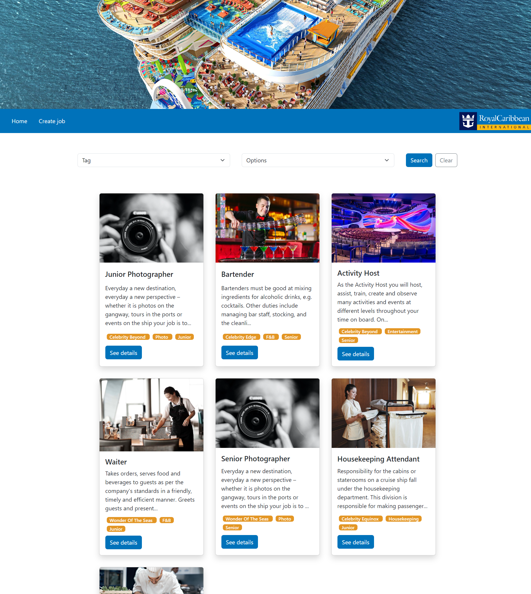

# **JOBS**

## ABOUT

This project is about a job board (subject was free, I choosed a cruise ship company). In this case we learn how to work with APIs. I used MockApi to create my database, the one I will work with in the code.

## Skills used

## WEBSITE STRUCTURE

### ✦ Header

Here we can find a representative photo of the company and a navbar with the logo and to links. Home to get back to the main view and create job to add a new job to the database.

### ✦ Main

Here we have all the sections hidding. The first one you see when you enter is the one that display the job list. But if you click on "create job" it will hide it and open the one to add a new job. You also have de edit and detail view that you can access from "see details" button on each job card. It will open the detail view, also hidding the main view, and then if you click edit it will open the edit view. The same happens with delete button at job details, it will open a modal that ask you if you want to delete it with a cancel and a delete button.

### ✦ Footer

Just a small footer with my social media.

## NEW KNOWLEDGE APPLIED

### ✦ API

In this project, the main goal is to be able to apply api knowledge. To understan how an api works and how we can get/modify the information on it. For that I used MockAPI so I could have my own database.

## RESOURCES

For this website I used different kinds of resources:

-   CSS Framework -> [Bootstrap](https://getbootstrap.com/docs/5.3/getting-started/introduction/)
-   Illustrations -> Google

## CONTACT ME

If you are interested in contacting me, as I say it on the project, you can find me on the following links:

-   [LinkedIn](https://www.linkedin.com/in/romina-yazm%C3%ADn-rao-50a61a1ba/)
-   [raoromina96@gmail.com](mailto:raoromina96@gmail.com)
-   [Instagram](https://instagram.com/renga.art/)
-   [Check my other GitHub repositories](https://github.com/RomiRao?tab=repositories)
